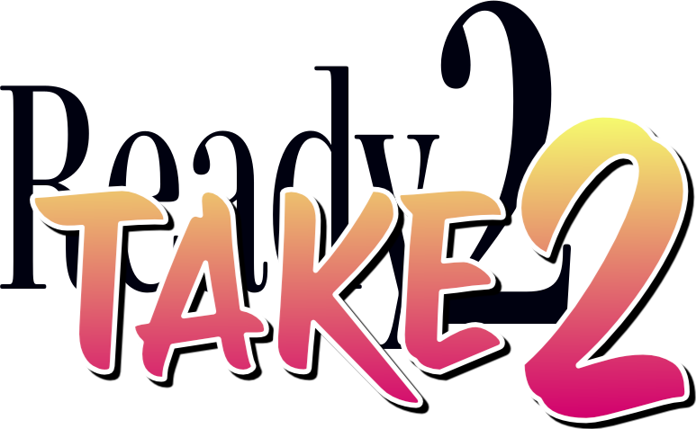

# Ready2Take2

<p align="center" width="100%">
	
</p>

A web application simplifying coordination between the director and camera operators. Inspired by available commercial solutions, Ready2Take2 tries to help the team produce a tightly timed, planned show without taking away control. The director can plan shots and cues based on an earlier recording, then they can step through the cues while all camera operators can follow along the progression of the show on mobile devices and screens. Countdowns provide information on length of the shot.

Progression through the cues is manual triggered by the director or by reacting to transitions happening in the switcher.

## Quick start

Easiest way to get going is to use [Docker Compose](https://docs.docker.com/compose/install/). Create [docker-compose.yaml](./docker-compose.yaml) file:
```yaml
services:
  ready2take2:
    image: jstarpl/ready2take2:latest
    container_name: ready2take2
    restart: unless-stopped
    ports:
      - "3000:3000"
	  - "8000:8000/udp"
    volumes:
      - ./data:/app/data
```

Run
```bash
docker-compose up -d
```

Open the app at `http://localhost:3000` and sign in with the default credentials:
- Username: `admin`
- Password: `admin123!`

## Fast start for development

1. Install dependencies:
	 - `pnpm install`
2. Start client + server in one command:
	 - `pnpm dev`
3. Open the app:
	 - Client: `http://localhost:5173`
	 - Server: `http://localhost:3000`

## Validation commands

- `pnpm build` builds the client and compiles the server
- `pnpm typecheck` runs TypeScript checks for client and server
- `pnpm start` starts the compiled server (`dist/server/index.js`)

## Stack

- Vite + React
- Express + tRPC
- SQLite + TypeORM
- Zod
- Tailwind + shadcn-style UI foundation

## Existing features

- Auth
	- Username/password login with server-side session cookie
	- Seeded admin account for local development
- Projects and shows
	- Create projects and shows
	- Show creation automatically creates a default `Camera` track
- Show workspace
	- Create, update, delete, and reorder cues
	- Set `current` and `next` cue pointers
	- `Take` action (and `F12` shortcut) to advance cue pointers
	- Edit per-track technical identifiers for each cue
	- Create/remove tracks with automatic cue-track value backfill/integrity handling
- Collaboration and refresh
	- Show-scoped realtime events over WebSockets/tRPC subscriptions
	- Client refresh through query invalidation on mutation success and subscription events
- Media
	- Upload and delete show-scoped media files
	- Select media for the workspace and control playback in the bottom media player
	- Cue List View route for a focused cue display/filter workflow

## Core concepts

- Project
	- Top-level container for shows.
- Show
	- Production workspace holding tracks, cues, media files, and two pointers: `currentCueId`, `nextCueId`.
- Track
	- Column-like dimension (for example: camera, audio, graphics) shared across all cues in a show.
- Cue
	- Ordered show event with `cueId`, `comment`, and optional `cueOffsetMs`.
- CueTrackValue
	- Per-cue/per-track technical identifier value.
	- Every cue should have one value row for every track in the same show.
- Show-scoped realtime
	- Mutations publish events for a single show, and clients viewing that show refresh from those events.

## Default development login

The server seeds a default user on first start:

- username: `admin`
- password: `admin123!`

## Notes

- SQLite data is stored under `data/ready2take2.sqlite`
- Uploaded media is stored under `data/uploads`
- Import alias `@/` resolves to `src/`
- This is a scaffold, not a finished production app